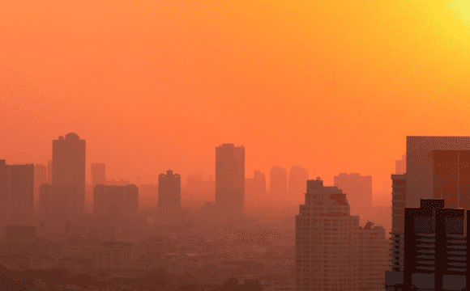

This is the homepage of the ARDC funded Integrated National Air Pollution and Health Data https://doi.org/10.47486/PS022 of the Centre for Air pollution, energy, and health Research (CAR).

Air pollution threatens human health globally, and a big part of it is caused by humans. In cities across Australia, anthropogenic air pollution comes from energy use and transport infrastructure. Air pollution also comes from the landscape. For example, fires and dust cause air pollution, and we are seeing more of these with droughts getting longer and more severe due to climate change. Even at a low level, it is detrimental to public health. To tackle it, public efforts in such areas as cutting emissions have to be coordinated.

To inform policy changes, epidemiologists and public sector agencies need integrated air pollution and health datasets, ideally at the national level. But with air pollution reporting standards differing from state to state and privacy restrictions on public health data, integrating the datasets is no easy task.
The Response

This project will standardise data inputs from all air pollution monitoring stations in Australia. It will build a database containing all historical and current observations, including those for particulate matter of 2.5 µm (PM2.5), nitrogen dioxide (NO2), carbon monoxide (CO), sulphates (SO2), ozone (O3) and ultrafine particles (UFP).

To estimate exposures at high spatial and temporal resolutions, this data will then be used in exposure models that accommodate predictors from: 

1.    atmospheric chemistry modelling 
1.    satellite, weather and traffic observations 
1.    land use and vegetation data. 

These exposure data will be combined with age- and cause-specific mortality in sufficiently populated areas.
